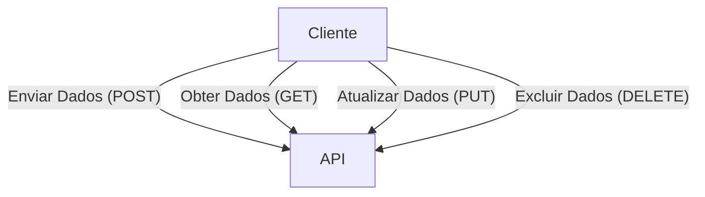
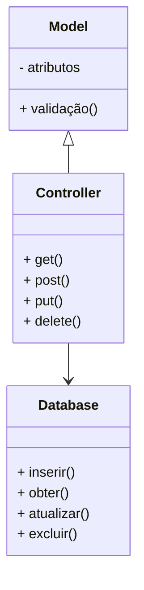
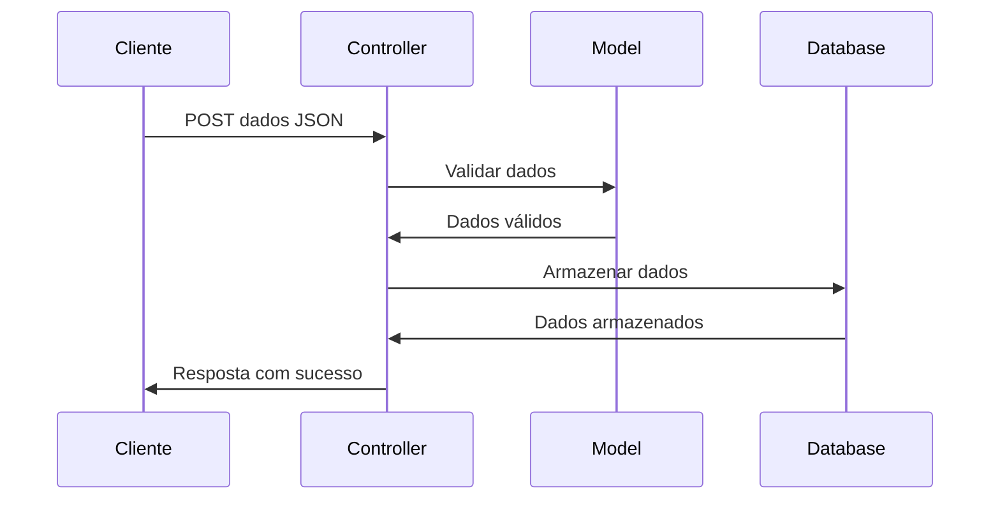
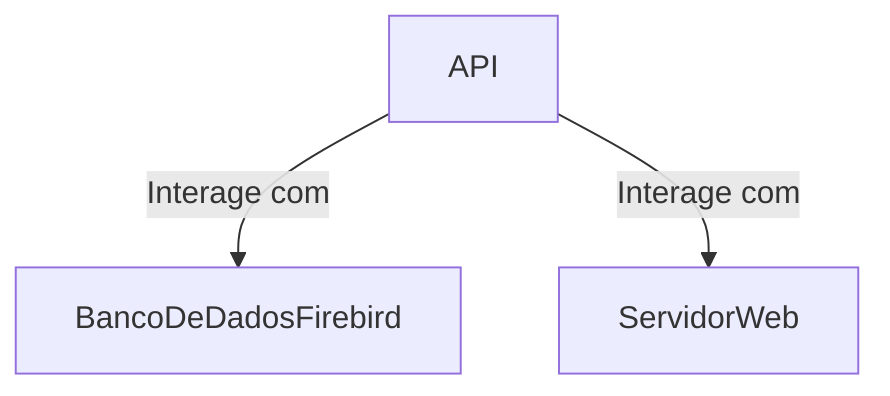
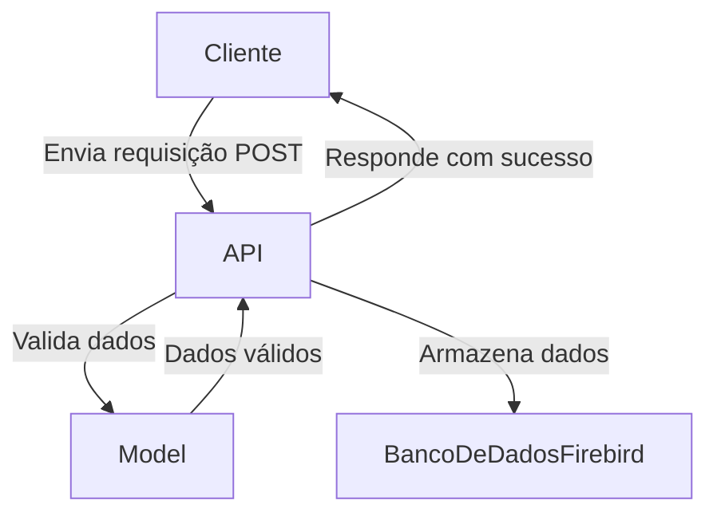

# firebird-api

__Aqui está uma representação em linguagem Mermaid para os diagramas solicitados:__

### Diagrama de Casos de Uso

### Diagrama de Classes

### Diagrama de Sequência

### Diagrama de Componentes

### Diagrama de Atividade

Esses diagramas fornecem uma visão geral dos diferentes aspectos da arquitetura de um sistema de API com um banco de dados Firebird. Você pode ajustar esses diagramas conforme necessário para refletir os detalhes específicos do seu projeto.
